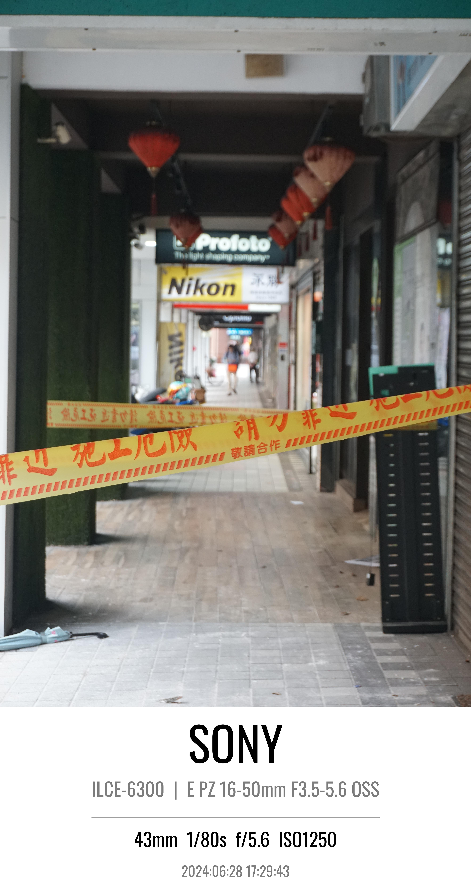

<style>
td, th {
   border: none!important;
}
</style>

# Camera Mark

### Overview

This script processes images to extract EXIF data, adds a border, and overlays text with the EXIF data onto the image. The processed images are saved in the specified output folder.

If you have many images to process, you no longer need to edit them one-by-one manually. With **Camera Mark**, all the process can be done automatically.

### Features

- Extracts EXIF data from images and add info to it.
- Processes images in a specified folder or a single image file.

### Installation

Ensure you have Python 3.6+ installed. Install the required libraries using:

```sh
pip install pillow exifread tqdm
```

### Usage

#### Command line argument
- `--path` or `-p`: Path to the image or folder containing images to process (required).
- `--output_folder` or `-of`: Path to the folder where processed images will be saved (default is ./output).

#### Example

To process a single image:
```sh
python camera_mark.py --path ./input/image.JPG --output_folder ./output
```

To process all files in a single folder:
```sh
python camera_mark.py --path ./input --output_folder ./output
```

#### Demo
<table style="border:none">
    <tr>
        <td valign="top">
            
        </td valign="top">
        <td valign="top">
            
        </td valign="top">
    </tr>
</table>

💡 **Notice**: *The blue borders only exist in readme file in order to show the images' borders. The output of the script only contains the part inside the blue border.*

### Troubleshooting

- Ensure the input path and output folder are correctly specified.
- ***Only images with EXIF data can be processed.***

### Notes

- The script currently downloads the font each time it is run, which may be inefficient. Consider downloading the font once and storing it locally for repeated use.
- Ensure the EXIF data contains all the required tags for proper functioning. If some tags are missing, the script may not function as expected.

### Contact

For any questions or support, please contact:

- Email: b10705002@ntu.edu.tw
- GitHub: [ansonWuuuuu](https://github.com/ansonWuuuuu)
- LinkedIn: [吳亞宸 (Anson)](https://www.linkedin.com/in/ansonwu-88a673274/)
